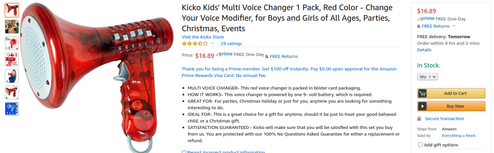
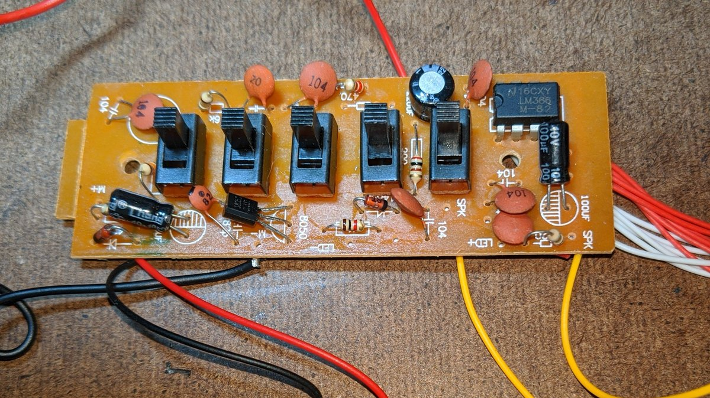

# megamodule

Circuit bending a toy voice changing megaphone into a synth module

Here is the megaphone I used:

[https://www.amazon.com/gp/product/B07VQLBBVB](https://www.amazon.com/gp/product/B07VQLBBVB) 

 

(It was available from Amazon Warehouse for about $5 at the time.)

Photos of the circuit board:

 

 

In the last photo, the 16k resistor near the lower right corner is the pitch resistor. Its location on the underside is marked in the diagram below along with +9V and 0V traces.

Connections to the board:

1. LEDs
2. +9V and return side of speaker
3. Send side of speaker
4. 0V and return side of mic
5. Send side of mic
(The speaker connects to the LM386 output and the +9V rail. I replaced with output connections to the LM386 output and the ground rail.)

Toggle switches are the five sets of three connections across the middle: Bottom on each is ground and top two connect to the sound chip.

Schematic of modifications:

[PDF version](megamodule/megamodule.pdf) 

Added circuitry laid out for using one of my [prototyping boards](https://github.com/holmesrichards/Protoboard) :

 

Block at left with LED and resistor is vactrol. Blocks at right center are Molex connectors for panel components.
